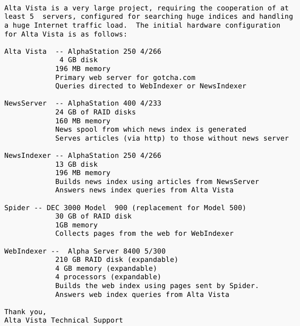

```{r, echo=FALSE}
library(metathis)
meta() %>% 
  meta_description(params$event) %>% 
  meta_name("github-repo" = paste0("datactivist/", params$slug)) %>% 
  meta_viewport() %>% 
  meta_social(
    title = params$title,
    url = paste0("https://datactivist.coop/", params$slug),
    image = params$image,
    image_alt = params$image_alt,
    og_type = "website",
    og_author = "Datactivist",
    og_locale = "fr_FR",
    og_site_name = "Datactivist",
    twitter_card_type = "summary",
    twitter_creator = "@datactivi_st")

```

layout: true

<style>
.remark-slide-number {
  position: inherit;
}

.remark-slide-number .progress-bar-container {
  position: absolute;
  bottom: 0;
  height: 4px;
  display: block;
  left: 0;
  right: 0;
}

.remark-slide-number .progress-bar {
  height: 100%;
  background-color: #e95459;
}

</style>


`r paste0("<div class='my-footer'><span>", params$event, "</span> <center><div class=logo><a href='https://datactivist.coop/'></a></div></center></span></div>")` 

---
class: inverse, center, middle
background-image: url(./img/napo.png)

## De ChatGPT à Blade Runner :</BR>faut-il avoir peur de l'IA ?

### Joël Gombin (Datactivist et opsci.ai)

---

class: center, middle

Ces slides en ligne : `r paste0("http://datactivist.coop/", params$slug)`

Sources : `r paste0("https://github.com/datactivist/", params$slug)`


Les productions de Datactivist sont librement réutilisables selon les termes de la licence [Creative Commons 4.0 BY-SA](https://creativecommons.org/licenses/by-sa/4.0/legalcode.fr).

<BR>
<BR>


---
class: inverse, center, middle

# Qui a déjà utilisé ChatGPT ou un autre outil d'IA ?

---
## Testons ensemble

Allez sur [bing.com](bing.com) et utilisez la conversation (contrairement à ChatGPT, il ne nécessite pas d'inscription). 

Posez par exemple la question : "je vais visiter Poitiers, que puis-je y faire ?" ou encore "Ecris une requête Overpass turbo pour récupérer les écoles de Poitiers".


---

## Testons ensemble

Allez sur https://huggingface.co/Pclanglais/TintinIA et créez une image de Tintin (en promptant en anglais selon le modèle, par exemple "a drawing of Tintin walking in the streets of Poitiers, near the cathedral").

.center[
.reduite[

]
]

---
class: inverse, center, middle

# Intelligence artificielle : </BR> de quoi s'agit-il ?

---
## L'IA, c'est quoi ?

Un **champ de recherche** ancien qui vise à reproduire des fonctions cognitives humaines (raisonnement, perception, apprentissage, etc.) par des machines.

Ce terme d'IA renvoie à un **objectif**, mais ne parle pas des moyens d'y parvenir. Historiquement, des approches très différentes se sont développées (IA symbolique, connexionnisme, etc.).

Dans son usage courant, ce terme est vague et relève souvent du **marketing** (Antonio Casilli parle d' "[IA Potemkine](https://www.casilli.fr/2023/04/08/grand-entretien-pour-le-grand-continent-7-avril-2023/)" pour mettre en évidence le travail humain souvent dissimulé sous les atours de l'IA). 

---
## L'explosion des données et de la puissance de calcul

[.reduite[.center[]]](http://visual.ly/infographic-about-computers)

---
## L'explosion des données et de la puissance de calcul

[.reduite[.center[]]](https://tweets.kingkool68.com/tweet/655306196128280576/)

???

1996

---
## L'explosion des données et de la puissance de calcul

[.reduite[.center[]]](https://aws.amazon.com/blogs/aws/aws-snowmobile-move-exabytes-of-data-to-the-cloud-in-weeks/)

???

2016

---
## De la machine à calculer à l'IA


Par [David.Monniaux](https://commons.wikimedia.org/w/index.php?curid=186079), CC BY-SA 3.0

???

Pascaline, 1642
Les calculs sont inscrits "en dur" dans le matériel

---

## De la machine à calculer à l'IA

.center[
.reduite[

]
]

Par [David.Monniaux](https://commons.wikimedia.org/w/index.php?curid=186079), CC BY-SA 3.0

???

Métier Jacquard, premier usage des cartes perforées en 1801

---

## De la machine à calculer à l'IA

.center[
.reduite[

]
]
Par [Antoine Claudet](https://commons.wikimedia.org/wiki/File:Ada_Byron_daguerreotype_by_Antoine_Claudet_1843_or_1850.jpg), CC BY-SA 4.0

??? 

Ada Lovelace, invente la programmation avec la machine analytique de Babbage en 1843


---

## De la machine à calculer à l'IA

.pull-left[

Alan Turing
]

.pull-right[
[](https://commons.wikimedia.org/wiki/File:JohnvonNeumann-LosAlamos.jpg)
John von Neumann
]

???

Turing : machine de Turing (modèle théorique de l'ordinateur), construction d'un des premiers ordinateurs. Test de Turing (1950)

von Neumann : architecture de von Neumann (mémoire et processeur), MCMC... 

Les instructions logicielles remplacent les logiques inscrites en dur dans le matériel. le matériel devient très générique et progressivement moins coûteux (loi de Moore)

---

## De la machine à calculer à l'IA

[](https://en.wikipedia.org/wiki/Perceptron#/media/File:330-PSA-80-60_(USN_710739)_(20897323365).jpg)

???

Perceptron : algorithme créé en 1943, implémenté en 1957 sur un ordinateur. Réseau de neurones (trois couches) qui permet de résoudre des problèmes de classification linéaire, branché sur une caméra (400px).

---

## De la machine à calculer à l'IA

.center[.reduite[
[](https://fr.wikipedia.org/wiki/Yann_Le_Cun)
]]

???

Yann Le Cun, inventeur des réseaux convolutifs (fin années 1980) qui relancent l'idée des réseaux de neurones

---

## De la machine à calculer à l'IA

.center[.reduite[

]]

???

Word2Vec : modèle auto-apprenant, pas besoin d'annotations (Google, 2013). Embeddings : représentation vectorielle des mots (distance sémantique)


---

## De la machine à calculer à l'IA

[](https://proceedings.neurips.cc/paper_files/paper/2017/file/3f5ee243547dee91fbd053c1c4a845aa-Paper.pdf)

???

Création de l'architecture Transformer avec le mécanisme d'attention (Google, 2017). Progrès très significatif en matière de traduction, génération de texte... Architecture toujours dominante aujourd'hui.
BERT est le premier modèle à utiliser cette architecture pour le traitement du langage (Google, 2018). 110 et 340 M de paramètres, entraînés sur Wikipedia en anglais (2,5G mots) et 11000 livres (800M mots). Publié en open source et a été énormément finetuné 

---

## IA générative 

Les modèles aujourd'hui en vogue (GPT-3, DALL-E, CLIP...) sont des modèles génératifs. Ils sont capables de générer des images, du texte, des sons, etc. à partir d'un corpus d'apprentissage.

L'idée est d'imiter des créations humaines (texte, image, son, vidéo...) grâce à des corpus de données immenses (tout internet, en gros). 

Par cette imitation, des capacités cognitives sont simulées (compréhension du langage, de l'image, etc.). Plus les données sont massives, plus l'imitation est bonne. 

Mais ces modèles n'ont pas de notion de vérité ou de factualité, d'où les hallucinations que produisent ces modèles. 

---

## La force des modèles pré-entraînés 

Durant la vague du "Big data" (années 2010), on avait coutume de dire que les outils de *machine learning* ne fonctionnaient bien qu'à condition d'avoir de **très grandes quantités de données**. Cela disqualifiait beaucoup d'acteurs, dont beaucoup d'acteurs publics, et consacrait la domination des grands acteurs du numérique. 

Les modèles qui prévalent aujourd'hui sont dit **pré-entraînés** : ils ont été entraînés sur d'immenses corpus (tout internet, en gros) et peuvent être utiles sans entraînement spécifique sur les données de l'utilisateur (*zero shot*), avec très peu d'exemples (*few shots*) ou avec relativement peu de données (de préférence de qualité) (*fine tuning*). 

Cela rebat donc les cartes : des usages peuvent être développés pour tous types d'acteurs. La qualité des données compte plus que la quantité. 

La diffusion de modèles ouverts, tels que **LlaMa**, permet de développer des modèles personnalisés et des usages très variés. 

---
class: inverse, center, middle

# AGI ou copilote ? 

---

## La science fiction...

.center[.reduite[

]]
---

## La réalité

.center[.reduite[

]]

---

## La réalité

.center[.reduite[

]]

---

## La réalité

.center[.reduite[

]]

???

Impact sur l'emploi : certainement, en augmentant la productivité de certains métiers et donc en les transformant. parallèle avec le tableur qui a transformé les métiers de la comptabilité et de la finance : moins de comptables, plus d'analystes. 

---

## Alignement et éthique de l'IA

Plus de questions que de réponses !

- "aligner" l'IA... oui mais aligner sur quoi ?
- l'IA est-elle un outil ou un agent ? N'ayant pas d'intentionnalité ni d'agentivité, peut-il y avoir plus d'éthique de l'IA que d'éthique du pic à glace ou du tableur ? 
- quel économie politique : quelle valeur extraite, auprès de qui, redistribuée comment ? Quelle distribution du pouvoir ? 

---
# Merci !

Contact : [joel@datactivist.coop](mailto:joel@datactivist.coop)


